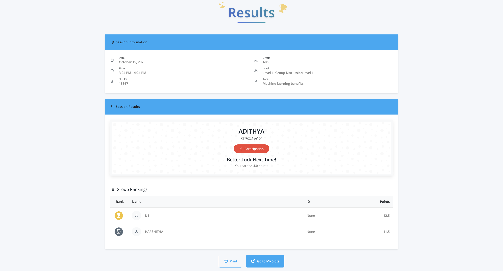

# Smart Group Discussion Platform

<div style="float: right; margin-left: 20px;">
  
</div>

The **Smart Group Discussion (GD) Platform** is a web-based system designed to automate and streamline group discussions for academic, recruitment, and training purposes. It addresses common issues such as **dominance, bias, and lack of transparency** in traditional GD formats by introducing **QR-based authentication, automated topic allocation, structured turn-taking, and peer evaluation mechanisms**.

The platform integrates **Django (backend), React (frontend), PostgreSQL (database)** to ensure scalability, security, and real-time performance. A custom **Bias-Filtered Weighted Rank Aggregation (BF-WRA)** algorithm is implemented to detect biased voting and normalize peer evaluation, guaranteeing fairness and accuracy in results.

## Features

- **QR-based Authentication** → Prevents proxy entries and ensures secure participation.  
- **Random Topic Allocation** → Eliminates manual bias in topic selection.  
- **Turn-Based Participation** → Prevents dominance and ensures balanced contributions.  
- **Peer Voting & Evaluation Dashboards** → Structured ranking for fairness.  
- **Bias Detection (BF-WRA Algorithm)** → Identifies manipulative or biased voting.  
- **PostgreSQL Secure Logging** → Stores session data for analytics and traceability.  
- **Real-Time Results** → Instant evaluation and leaderboard generation.  


## Workflow of the project


## Tech Stack
- **Frontend**: React, Bootstrap  
- **Backend**: Django, Django REST Framework  
- **Database**: PostgreSQL  
- **Authentication**: QR Code Integration  
- **Version Control**: GitHub  
- **Algorithm**: BF-WRA (Bias-Filtered Weighted Rank Aggregation)  


## Project Setup

Run the following command

**Step 1: Clone the Repository**

```bash
#Clone the Project 
git clone https://github.com/adhilogu/smart_group_discussion_portal.git


# Navigate to Django directory 
cd django-datta-able 

# Create virtual environment (recommended) 
python -m venv venv

# Activate virtual environment
# On Windows:
venv\Scripts\activate

# On macOS/Linux:
source venv/bin/activate

# Install dependencies
pip install -r requirements.txt

# Configure database settings in settings.py
# Update DATABASES configuration with your PostgreSQL credentials
```

**Step 2: Project setup**
```bash
# Run migrations
python manage.py makemigrations
python manage.py migrate
python manage.py collectstatic
```

**❗ Create user profiles and Set Role accordingly [Student,Faculty]**
**User with Role "Faculty" can only Host Groups**

```bash
# Create superuser (admin)
python manage.py createsuperuser


# Create ssl certificate
pip install django-extensions Werkzeug pyOpenSSL

# Generate a private key
openssl genrsa -out key.pem 2048

# Generate a certificate signing request (CSR).
openssl req -new -key key.pem -out csr.pem
```
```bash
# Add django_extensions to INSTALLED_APPS in your settings.py
    INSTALLED_APPS = [
        # ... other apps
        'django_extensions',
    ]
```

**Step 3: Start development server**
```bash
python manage.py runserver_plus 8000 --cert-file cert.pem  
```

At this point, the app runs at https://127.0.0.1:8000/

Admin panel at  https://127.0.0.1:8000/admin

## Snapshots of the Project

<div style="display: flex; flex-wrap: wrap; gap: 20px; justify-content: space-between;">
  <div style="flex: 1 1 45%; text-align: center;">
    <div style="background-color: #f5f6fa; padding: 0; border-radius: 10px; box-shadow: 0 4px 8px rgba(0, 0, 0, 0.1); overflow: hidden;">
      
    </div>
    <p style="margin: 10px 0 20px 0; font-weight: bold; color: #2c3e50;">Admin Panel</p>
  </div>
  <div style="flex: 1 1 45%; text-align: center;">
    <div style="background-color: #f5f6fa; padding: 0; border-radius: 10px; box-shadow: 0 4px 8px rgba(0, 0, 0, 0.1); overflow: hidden;">
      
    </div>
    <p style="margin: 10px 0 20px 0; font-weight: bold; color: #2c3e50;">Creating a Slot</p>
  </div>
  <div style="flex: 1 1 45%; text-align: center;">
    <div style="background-color: #f5f6fa; padding: 0; border-radius: 10px; box-shadow: 0 4px 8px rgba(0, 0, 0, 0.1); overflow: hidden;">
      
    </div>
    <p style="margin: 10px 0 20px 0; font-weight: bold; color: #2c3e50;">Creating Groups Inside Slots</p>
  </div>
  <div style="flex: 1 1 45%; text-align: center;">
    <div style="background-color: #f5f6fa; padding: 0; border-radius: 10px; box-shadow: 0 4px 8px rgba(0, 0, 0, 0.1); overflow: hidden;">
      
    </div>
    <p style="margin: 10px 0 20px 0; font-weight: bold; color: #2c3e50;">Creating Groups</p>
  </div>
  <div style="flex: 1 1 45%; text-align: center;">
    <div style="background-color: #f5f6fa; padding: 0; border-radius: 10px; box-shadow: 0 4px 8px rgba(0, 0, 0, 0.1); overflow: hidden;">
      
    </div>
    <p style="margin: 10px 0 20px 0; font-weight: bold; color: #2c3e50;">Showing QR Code to Join Group</p>
  </div>
  <div style="flex: 1 1 45%; text-align: center;">
    <div style="background-color: #f5f6fa; padding: 0; border-radius: 10px; box-shadow: 0 4px 8px rgba(0, 0, 0, 0.1); overflow: hidden;">
      
    </div>
    <p style="margin: 10px 0 20px 0; font-weight: bold; color: #2c3e50;">Joining Group via QR Code</p>
  </div>
  <div style="flex: 1 1 45%; text-align: center;">
    <div style="background-color: #f5f6fa; padding: 0; border-radius: 10px; box-shadow: 0 4px 8px rgba(0, 0, 0, 0.1); overflow: hidden;">
      
    </div>
    <p style="margin: 10px 0 20px 0; font-weight: bold; color: #2c3e50;">Host Waiting for Minimum 6 Members</p>
  </div>
  <div style="flex: 1 1 45%; text-align: center;">
    <div style="background-color: #f5f6fa; padding: 0; border-radius: 10px; box-shadow: 0 4px 8px rgba(0, 0, 0, 0.1); overflow: hidden;">
      
    </div>
    <p style="margin: 10px 0 20px 0; font-weight: bold; color: #2c3e50;">Group Started</p>
  </div>
  <div style="flex: 1 1 45%; text-align: center;">
    <div style="background-color: #f5f6fa; padding: 0; border-radius: 10px; box-shadow: 0 4px 8px rgba(0, 0, 0, 0.1); overflow: hidden;">
      
    </div>
    <p style="margin: 10px 0 20px 0; font-weight: bold; color: #2c3e50;">Group Joining Status</p>
  </div>
  <div style="flex: 1 1 45%; text-align: center;">
    <div style="background-color: #f5f6fa; padding: 0; border-radius: 10px; box-shadow: 0 4px 8px rgba(0, 0, 0, 0.1); overflow: hidden;">
      
    </div>
    <p style="margin: 10px 0 20px 0; font-weight: bold; color: #2c3e50;">Members Speaking in Discussion</p>
  </div>
  <div style="flex: 1 1 45%; text-align: center;">
    <div style="background-color: #f5f6fa; padding: 0; border-radius: 10px; box-shadow: 0 4px 8px rgba(0, 0, 0, 0.1); overflow: hidden;">
      
    </div>
    <p style="margin: 10px 0 20px 0; font-weight: bold; color: #2c3e50;">Requesting Voting</p>
  </div>
  <div style="flex: 1 1 45%; text-align: center;">
    <div style="background-color: #f5f6fa; padding: 0; border-radius: 10px; box-shadow: 0 4px 8px rgba(0, 0, 0, 0.1); overflow: hidden;">
      
    </div>
    <p style="margin: 10px 0 20px 0; font-weight: bold; color: #2c3e50;">Voting</p>
  </div>
  <div style="flex: 1 1 45%; text-align: center;">
    <div style="background-color: #f5f6fa; padding: 0; border-radius: 10px; box-shadow: 0 4px 8px rgba(0, 0, 0, 0.1); overflow: hidden;">
      
    </div>
    <p style="margin: 10px 0 20px 0; font-weight: bold; color: #2c3e50;">Positive Voting Results</p>
  </div>
  <div style="flex: 1 1 45%; text-align: center;">
    <div style="background-color: #f5f6fa; padding: 0; border-radius: 10px; box-shadow: 0 4px 8px rgba(0, 0, 0, 0.1); overflow: hidden;">
      
    </div>
    <p style="margin: 10px 0 20px 0; font-weight: bold; color: #2c3e50;">Negative Voting Results</p>
  </div>
</div>


---
## Demo
 Voting
## 📧 Support
For assistance with the **Smart Group Discussion Platform**, contact us:

<div style="text-align: left;">
  
  <p>Email: <a href="mailto:adhilogu2004@gmail.com">adhilogu2004@gmail.com</a></p>
</div>


[](https://www.linkedin.com/in/adithya-loganathan-a47218283/)
[](https://www.instagram.com/adithyaloganathanh/?hl=en)
[](https://github.com/adhilogu)

